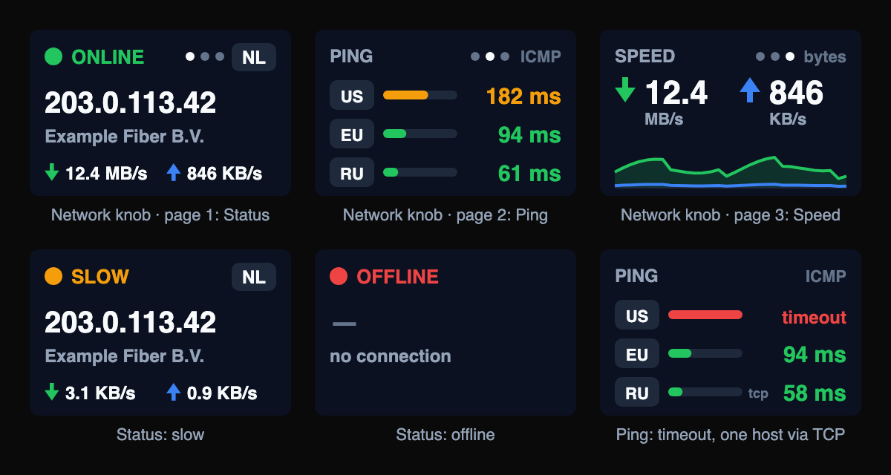
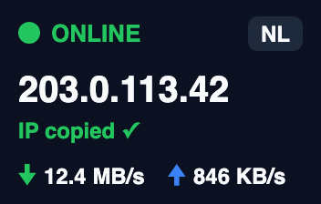
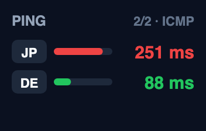
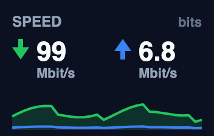
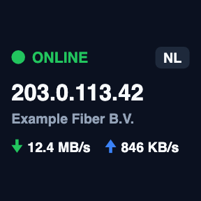
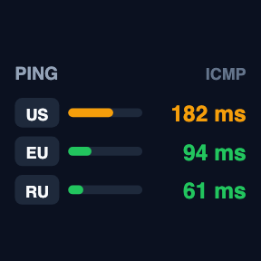

# Stream Dock Network

> **macOS only.** The plugin reads network data with macOS tools (`/sbin/ping`, `route`, `netstat`, `pbcopy`), and it ships only a macOS build.

A [Mirabox Stream Dock](https://mirabox.net) plugin for macOS with four network actions. Each one works on a knob (176×112 panel) and on a normal key (144×144).

## What you'll see



Top row: the **Network** knob's three pages (turn to cycle; the dots show the page). Bottom row: a slow and an offline connection, and a ping list with one host not answering and one reached over TCP. All values are examples.

<table>
<tr><td align="center"><br><sub>Status: IP copied (press)</sub></td><td align="center"><br><sub>Ping: 5 hosts, page 2 of 2</sub></td><td align="center"><br><sub>Speed: in bits</sub></td></tr>
<tr><td align="center"><br><sub>Status on a key</sub></td><td align="center"><br><sub>Ping on a key</sub></td><td></td></tr>
</table>

## Actions

### Network (the main knob action)

Status, Ping and Speed on one knob. The dots on the panel show which page you're on.

| Input | Effect |
|---|---|
| Turn | Next / previous page: Status → Ping (one page per 3 hosts, so 5 hosts give Ping 1/2 and 2/2) → Speed, then back to Status |
| Press | The current page's action: copy the IP and refresh (Status), ping now (Ping), bytes ⇄ bits (Speed) |

The **ring light always shows the connection**: green online, amber slow, red offline. When the action leaves the page, the ring goes back to the colour set in the Stream Dock app. On a normal key the action stays on the Status page.

The other three actions show one page each, for keys and other knobs.

### Network Status

Shows **online / slow / offline**, your **external IP**, the **country** and the **ISP**, plus a compact ↓/↑ speed line.

| Input | Effect |
|---|---|
| Press | Copies the IP to the clipboard (the panel says `COPIED`) and checks again right away |

- **Online:** the IP lookup worked **or** at least one host answered a ping.
- **Offline:** neither worked.
- **Slow:** online, but at least half the hosts failed, or every reply was slower than the "Slow above" setting (300 ms by default). One dead host among several doesn't count.

The Status action pings the three default hosts (US, EU, RU); the Network knob pings its own host list. When the IP lookup fails, the last known IP stays on the panel, dimmed.

### Ping

Latency to your own list of hosts, three per page.

| Input | Effect |
|---|---|
| Turn | Next / previous page (wraps around) |
| Press | Ping all hosts now |

The default hosts are:

| Label | Host |
|---|---|
| US | `speedtest.newark.linode.com` |
| EU | `speedtest.frankfurt.linode.com` |
| RU | `ya.ru` |

You can have 1 to 8 hosts. **Don't use anycast addresses** like `8.8.8.8` or `1.1.1.1` to measure a region: they always answer from the server nearest to you, so a "US" entry with `8.8.8.8` would really show your local latency. Use a host that actually lives in the region, such as a provider's speed-test server.

### Speed

The current download and upload rate of the active connection (the interface of the default route), with a short history graph.

| Input | Effect |
|---|---|
| Press | Switches between bytes (`MB/s`) and bits (`Mbit/s`). The choice is saved. |

Units step by 1000, like Activity Monitor and speed tests. Values under 10 get one decimal (`4.2 MB/s`), larger ones none (`12 MB/s`).

## Settings

Open an action in Stream Dock to see its settings.

| Setting | Actions | Default | Notes |
|---|---|---|---|
| Check every | all | 10 s (Network, Status, Ping), 2 s (Speed) | Network/Status 5–3600 s, Ping 2–3600 s, Speed 1–60 s |
| Speed every | Network | 2 s | 1–60 s |
| IP service | Network, Status | Auto | See below |
| ipinfo token | Network, Status | none | Optional [ipinfo.io](https://ipinfo.io) access token, used by Auto and ipinfo. Shown only for those two. |
| Slow above | Network, Status | 300 ms | 50–5000 ms |
| Ping method | Network, Status, Ping | ICMP | **ICMP:** `ping -c 1 -t 2`, and a host that doesn't answer is tried over TCP (see below). **TCP:** always time the connection to port 443. TCP also works for IPv6 addresses. |
| Hosts | Network, Ping | US, EU, RU | Label (up to 8 characters) + host name or IP. 1–8 entries. |
| Units | Network, Speed | Auto | Auto, K, M or G |
| Show as | Network, Speed | Bytes | Bytes or bits |

**ICMP → TCP fallback.** Some firewalls and VPNs drop ping. When a host doesn't answer ICMP but does answer on TCP port 443, the plugin pings it over TCP from then on and checks ICMP again after an hour. A host whose name doesn't resolve isn't retried over TCP.

### IP services

| Service | Shows | Notes |
|---|---|---|
| **Auto** (default) | IP, country, ISP | The IP from `ipify` every check (`icanhazip` if ipify fails). Country and ISP from `ipinfo` only when the IP changes, cached per IP. If ipinfo fails, the IP is shown without a country, and ipinfo is asked again after the next IP change or an hour. |
| `ipinfo` | IP, country, ISP | `https://ipinfo.io/json`, every check. The free plan allows 50,000 requests a month; a 10 s check needs about 260,000, so use Auto or a paid token. |
| `ip-api` | IP, country, ISP | `http://ip-api.com/json`. Plain HTTP only, limited to 45 requests a minute. |
| `ipify` | IP only | `https://api.ipify.org?format=json` |
| `icanhazip` | IP only | `https://icanhazip.com` |

If a service fails (error, timeout after 5 s, or a reply that isn't an IP address, like a Wi-Fi login page), `ipify` and then `icanhazip` are used for the IP. They have no request limits, so a failing ipinfo or ip-api never turns into extra calls to another limited service. Country and ISP are cached per IP, so an "IP only" answer for a known IP still shows them.

If you use a VPN or proxy that only covers some traffic, services can see different IPs. Plain-HTTP `ip-api` in particular may go a different route than the HTTPS services.

## Requirements

- macOS
- Stream Dock app 3.10.191 or newer. It runs the plugin with its built-in Node 20.
- Mirabox **N4 Pro**, for the Network knob's ring light (`5548:1021`, `5548:1023`, `5548:1008`). Everything else works on any Stream Dock device.
- Node.js / npm, used by `install.sh` to install dependencies.

## Install

```sh
git clone https://github.com/OneAtDrt/stream_dock_network.git
cd stream_dock_network
./install.sh
```

`install.sh` does three things:
1. Installs dependencies.
2. Copies `com.oneatdrt.network.sdPlugin` into `~/Library/Application Support/HotSpot/StreamDock/plugins/`.
3. Restarts Stream Dock.

Then, in Stream Dock, drag **Network** onto a knob, and/or **Network Status**, **Ping** and **Speed** onto keys or other knobs. They're in the **Network** category.

To update, pull and run `./install.sh` again.

## How it works

| Part | File | Details |
|---|---|---|
| Stream Dock wiring | `plugin/index.js` | Handles `willAppear`, `didReceiveSettings`, `sendToPlugin`, `dialRotate`, `dialDown` and `keyUp`, and draws panels with `setImage` (only when the image changed). Work is shared: all actions using the same IP service, the same host list and method, or the speed sampler share one polling loop, which runs at the shortest interval any of them asked for. The speed sampler also runs while a Status or Network panel is shown, for its ↓/↑ line. |
| Network knob pages | `plugin/knob-pages.js` | `knobPages(hostCount)` → Status, Ping pages, Speed; `turnKnob` wraps around. |
| Ring light | `plugin/knob-led.js` | Copied from the Audio Control plugin. Stream Dock's plugin API can't colour knob rings, so the plugin sends the N4 Pro's own USB HID command ([mirajazz](https://github.com/ambiso/mirajazz)) with [`node-hid`](https://github.com/node-hid/node-hid), opened in shared mode (`nonExclusive: true`) so Stream Dock stays connected. Writes wait 800 ms after a redraw, happen only when the colour changes, and are re-sent every 60 s. Rings the plugin doesn't own keep the Stream Dock app's colour. |
| Settings | `plugin/settings.js` | Defaults, limits and validation for every action. The Property Inspector loads the same file, so both sides agree. Hosts must be a plain host name or IP address and can't start with `-`. |
| External IP | `plugin/ip.js` | Provider table (URL + parser each), the Auto logic, fallbacks, 5 s timeout, country/ISP cache per IP, last good result. |
| Ping | `plugin/ping.js` | ICMP runs `/sbin/ping -c 1 -t 2 -q <host>` (no shell) and reads the average from the `round-trip` line. Exit code 2 means no reply, 68 an unknown host. TCP resolves the name first, then times only the connection to port 443. All hosts are pinged in parallel. The ICMP → TCP fallback is remembered per host for the whole plugin. Also has the paging helpers. |
| Speed | `plugin/speed.js` | Finds the interface with `route -n get default` (re-checked every 10 samples, so Wi-Fi ↔ Ethernet switches are picked up). Reads byte counters from the `<Link#…>` row of `netstat -ibn -I <interface>`. Rate = change / elapsed time. A counter reset or interface change skips one sample instead of showing a spike. |
| Online state | `plugin/status.js` | The online / slow / offline rules above. |
| Units | `plugin/units.js` | `formatRate(bytesPerSec, { unit, mode })` → `{ value: '12', unit: 'MB/s' }`, `formatLatency(ms)`. |
| Panel images | `plugin/render.js` | SVG images for the 176×112 panel and 144×144 keys: `renderStatus`, `renderPing`, `renderSpeed`, each `(model, { square })`. The approved design; draft mockups were made with a separate script that isn't part of the repo. |
| Settings page | `propertyInspector/` | One page for all four actions that shows the right fields for the action. Saves with `setSettings` and also sends the settings to the plugin directly. |

### Limitations

- ICMP ping is IPv4 only (macOS needs `ping6` for IPv6). Use TCP for IPv6 addresses.
- One USB packet sets all four rings. Plugins that use `knob-led.js` (Network, Audio Control ≥ 0.2.1) share their ring colours through a small file in the temp folder, so they don't reset each other's knobs; other plugins' rings get the Stream Dock app's colour.
- Speed shows the traffic of the default interface only. Traffic over a VPN tunnel may be counted on both the tunnel and the physical interface, depending on which one holds the default route.

## Development

```sh
cd com.oneatdrt.network.sdPlugin/plugin
npm install
npm test
```

The plugin writes its log to `plugin/log/plugin.log` inside the installed plugin folder.

README previews: `node scripts/previews.js` redraws `docs/previews/*.png` with the plugin's real `render.js` (needs Google Chrome).

## Version history

See [CHANGELOG.md](./CHANGELOG.md).
